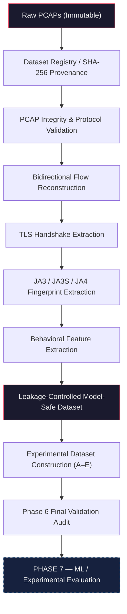

<div align="center">

# Encrypted Traffic Threat Hunter (ETTH)

### Academic Research Project — Encrypted Traffic Analysis & Threat Detection

[](#-research-status)
[](#-phase-progress)
[](#-phase-7--machine-learning--experimental-evaluation)
[](#-research-objective)
[](#-leakage-controls--model-safe-data)
[](https://www.python.org/)
[](#-test-suite)

**Investigating whether combining TLS fingerprint features with encrypted-flow behavioral features can improve malicious encrypted-traffic detection — without decrypting network payloads.**

</div>

---

## Table of Contents

- [Research Objective](#-research-objective)
- [Research Status](#-research-status)
- [Dataset Strategy](#-dataset-strategy)
- [Pipeline Architecture](#-pipeline-architecture)
- [Phase Progress](#-phase-progress)
- [Phase 6 Verified Metrics](#-phase-6-verified-metrics)
- [Experimental Design](#-experimental-design)
- [Leakage Controls & Model-Safe Data](#-leakage-controls--model-safe-data)
- [Critical Scientific Limitations](#-critical-scientific-limitations)
- [Phase 7 — Machine Learning / Experimental Evaluation](#-phase-7--machine-learning--experimental-evaluation)
- [Repository Structure](#-repository-structure)
- [Test Suite](#-test-suite)
- [Roadmap](#-roadmap)
- [Research Integrity Principles](#-research-integrity-principles)

---

## 🎯 Research Objective

The **Encrypted Traffic Threat Hunter (ETTH)** project investigates whether encrypted network traffic can be classified as malicious using observable network metadata — without decrypting application payloads.

> **Central Research Question:** Does combining TLS fingerprint information with encrypted-flow behavioral characteristics provide a measurable advantage for malicious encrypted-traffic detection compared with using either feature family independently?

The project evaluates five experimental configurations to isolate feature-family contributions:

| Experiment | Feature Family | Purpose |
|:----------:|:---------------|:--------|
| **A** | Flow-only | Behavioral baseline without fingerprints |
| **B** | JA3-only | Isolated client TLS fingerprint signal |
| **C** | JA4-only | Isolated modern client TLS fingerprint signal |
| **D** | JA3 + Flow | Legacy fingerprint fusion |
| **E** | JA4 + Flow | Modern fingerprint fusion (primary hypothesis test) |

### Zero-Decryption Principle

ETTH does **not** decrypt TLS payload contents. The research operates exclusively on information observable from encrypted network traffic:

- **TLS Handshake Metadata** — version, extensions, cipher suites, ALPN, SNI presence
- **TLS Fingerprints** — JA3 (client), JA3S (server), JA4 (modern client)
- **Packet / Flow Behavior** — sizes, counts, byte volumes, directional statistics
- **Temporal Characteristics** — inter-arrival times, burst patterns, idle gaps
- **Structural Features** — flow duration, asymmetry ratios, sequence geometry

---

## 📊 Research Status

| Component | Status |
|:----------|:-------|
| Research | **ACTIVE** |
| Phase 5 — Dataset Strategy | **CLOSED** |
| Phase 6 — Data Ingestion & Preprocessing | **CLOSED** |
| Phase 7 — ML / Experimental Evaluation | **NEXT** |
| Engineering Pipeline | **READY** |
| Scientific Evaluation | **READY WITH CONDITIONS** |
| ML Models | **NOT YET IMPLEMENTED** |
| Final Research Results | **NOT YET AVAILABLE** |
| Real-Time Detection | **NOT YET IMPLEMENTED** |

---

## 📦 Dataset Strategy

### Primary: DS-008 — Malware-Traffic-Analysis.net

**Role:** Modern TLS malware and C2 baseline

Real-world malware sandbox captures containing TLS-encrypted command-and-control traffic from contemporary threat families (AsyncRAT, XWorm, XLoader, etc.).

| Metric | Value |
|:-------|:------|
| PCAPs verified | 2 |
| Total reconstructed flows | 1,454 |
| TLS flows with ClientHello | 62 |
| JA3 / JA3S / JA4 extracted | 62 each |

### Validation: DS-004 — CipherSpectrum

**Role:** Modern TLS benign validation baseline

> ⚠️ DS-004 serves as a **BENIGN_VALIDATION** source — not a comprehensive paired benign training set. This distinction is scientifically important.

| Metric | Value |
|:-------|:------|
| PCAPs verified | 6 |
| Total reconstructed flows | 6 |
| TLS flows with ClientHello | 6 |
| JA3 / JA3S / JA4 extracted | 6 each |

### Pending: Potential Unified Datasets

| Dataset | Status | Potential |
|:--------|:-------|:----------|
| DS-006 — Beyond JA4+ | Academic access pending | Unified benign + malicious with raw PCAPs |
| DS-007 — Annotated Encrypted Network Traffic | Academic access pending | Large-scale annotated encrypted flows |

If academic access to DS-006 or DS-007 is obtained, the Phase 6 ingestion pipeline must be re-executed against those datasets to materially strengthen the experimental evaluation.

---

## 🔧 Pipeline Architecture

The completed Phase 6 pipeline transforms raw PCAPs into leakage-controlled experimental datasets:



**Key architectural properties:**
- **Immutable raw data** — PCAPs are never modified
- **SHA-256 provenance** — every artifact is traceable to its source
- **dpkt primary parser** with Scapy fallback
- **Deterministic processing** — identical inputs produce identical outputs
- **Tiered data flow** — RAW → INTERIM → PROCESSED → MODEL-SAFE

---

## 📈 Phase Progress

### Completed Phases

| Phase | Description | Status |
|:------|:------------|:-------|
| 1 | Research Problem Definition | ✅ Complete |
| 2 | Literature & Research Foundation | ✅ Complete |
| 3 | Experimental Methodology Design | ✅ Complete |
| 4 | Dataset Research & Selection Preparation | ✅ Complete |
| 5 | Dataset Evaluation, Expansion & Final Strategy | ✅ Closed |
| 6 | Data Ingestion & Preprocessing Pipeline | ✅ Closed |

### Phase 6 Steps

| Step | Description | Status |
|:-----|:------------|:-------|
| 1 | Ingestion Architecture | ✅ Complete |
| 2 | Ingestion Implementation | ✅ Complete |
| 3 | PCAP Integrity & Protocol Validation | ✅ Complete |
| 4 | Bidirectional Flow Reconstruction | ✅ Complete |
| 5 | JA3 / JA3S / JA4 Extraction | ✅ Complete |
| 6 | Behavioral Feature Extraction | ✅ Complete |
| 7 | Leakage-Controlled Model-Safe Dataset | ✅ Complete |
| 8 | Experimental Dataset Construction (A–E) | ✅ Complete |
| 9 | Final Validation / Closure Audit | ✅ Complete |

**Phase 6 Final Verdict:** SUPPORTED WITH CONDITIONS

---

## 📐 Phase 6 Verified Metrics

All metrics below are empirically verified against the actual generated artifacts (Phase 6 Step 9 audit).

### Dataset Inventory

| Source | PCAPs | Total Flows | TLS Flows | JA3 | JA3S | JA4 |
|:-------|------:|------------:|----------:|----:|-----:|----:|
| DS-008 (Malicious) | 2 | 1,454 | 62 | 62 | 62 | 62 |
| DS-004 (Benign Validation) | 6 | 6 | 6 | 6 | 6 | 6 |
| **Total** | **8** | **1,460** | **68** | **68** | **68** | **68** |

### Fingerprint Coverage

| Fingerprint | Available | Total | Coverage |
|:------------|----------:|------:|---------:|
| JA3 | 68 | 1,460 | 4.6% |
| JA3S | 68 | 1,460 | 4.6% |
| JA4 | 68 | 1,460 | 4.6% |

Missing fingerprints indicate the structural absence of a TLS ClientHello in the underlying flow (e.g., non-TLS traffic, mid-session capture, pure TCP noise). They are preserved as semantic nulls — not imputed to zero.

### Duplicate Analysis

| Metric | Value |
|:-------|------:|
| Exact duplicate behavioral geometries | 553 |
| Distinct duplicate groups | 41 |
| Cross-PCAP duplicate groups | 2 |
| Cross-label duplicate groups | 0 |

Duplicates primarily reflect repetitive malware beaconing behavior. They are retained but grouped to prevent identical vectors from leaking across train/test splits.

### Split Methodology

| Parameter | Value |
|:----------|:------|
| Algorithm | `GroupShuffleSplit` |
| Grouping variable | `behavioral_hash` (SHA-256 of feature vector) |
| Random seed | 42 |
| Test size | 0.2 |
| Verdict | **VALID WITH CONDITIONS** |

---

## 🧪 Experimental Design

### Class Balance

| Experiment | Total | MALICIOUS | BENIGN_VALIDATION | Imbalance Ratio |
|:----------:|------:|----------:|------------------:|:----------------|
| A (Flow) | 1,460 | 1,454 (99.6%) | 6 (0.4%) | ~242:1 |
| B (JA3) | 68 | 62 (91.1%) | 6 (8.8%) | ~10:1 |
| C (JA4) | 68 | 62 (91.1%) | 6 (8.8%) | ~10:1 |
| D (JA3+Flow) | 68 | 62 (91.1%) | 6 (8.8%) | ~10:1 |
| E (JA4+Flow) | 68 | 62 (91.1%) | 6 (8.8%) | ~10:1 |

### Experiment Readiness

| Experiment | Features | Status | Reason |
|:----------:|:---------|:-------|:-------|
| **A** | Flow-only (83 features) | READY WITH CONDITIONS | Large sample, but extreme class imbalance and dataset-source confounding |
| **B** | JA3-only (1 feature) | READY WITH CONDITIONS | Only 68 fingerprint-valid samples, 6 benign validation records |
| **C** | JA4-only (1 feature) | READY WITH CONDITIONS | Only 68 fingerprint-valid samples, 6 benign validation records |
| **D** | JA3 + Flow (84 features) | READY WITH CONDITIONS | Same fingerprint coverage and class-balance limitations |
| **E** | JA4 + Flow (84 features) | READY WITH CONDITIONS | Primary fusion experiment, constrained by small benign baseline |

> **"READY WITH CONDITIONS"** means the experiments are technically ready for controlled pilot evaluation. It does **not** mean that statistically strong universal conclusions are guaranteed from the current sample.

---

## 🔒 Leakage Controls & Model-Safe Data

The model-safe representation **excludes** all deterministic identifiers:

| Excluded | Reason |
|:---------|:-------|
| IP addresses (src/dst) | Host memorization |
| Ports (src/dst) | Service memorization |
| MAC addresses | Hardware identification |
| Raw SNI / domain strings | Environment fingerprinting |
| Absolute timestamps | Temporal leakage |
| Dataset identifiers | Dataset-source leakage |
| Source filenames | Capture-session memorization |
| Flow identifiers | Provenance leakage |

**Retained** information consists of legitimate behavioral and TLS structural features:

- Flow duration, packet counts, byte statistics
- Packet-length distributions (mean, std, percentiles)
- Inter-arrival time distributions (global, directional)
- Directional asymmetry ratios
- Burst and idle-gap statistics
- TLS structural metadata (version, handshake presence)
- SNI presence (boolean only — not the domain string)
- JA3, JA3S, JA4 fingerprint hashes
- Raw packet/timing sequences (for potential deep-learning use)

Provenance metadata is preserved in a separate audit table linked by a `model_safe_index`, ensuring reproducibility without exposing identifiers to ML models.

> Leakage controls eliminate programmatic identifier leakage. They do **not** eliminate dataset-source confounding — see [Critical Scientific Limitations](#-critical-scientific-limitations).

---

## ⚠️ Critical Scientific Limitations

### Dataset-Source / Capture-Environment Confounding

The current experimental datasets combine traffic from two substantially different capture environments:

| Property | DS-004 (Benign) | DS-008 (Malicious) |
|:---------|:----------------|:-------------------|
| Environment | Clean, isolated TLS validation | Chaotic malware sandbox |
| ClientHello coverage | 100% of flows | ~4% of flows |
| Flow characteristics | Short, pristine, single-flow PCAPs | Long, noisy, multi-flow PCAPs |
| Background traffic | Minimal | Extensive non-TLS noise |

**Consequence:** A model may learn to distinguish *capture environments* rather than genuine malicious behavior. For example, identifying "broken" or "noisy" flows as malicious because DS-008 inherently contains more non-TLS background traffic — not because the model has learned to detect C2 communication patterns.

This is a **known and documented limitation**. Aggressive leakage controls are implemented, but environmental confounding cannot be fully resolved without a unified dataset containing both benign and malicious traffic from the same capture infrastructure.

### Benign Sample Size

The current verified benign validation sample consists of only **6 flows** from DS-004. While this is sufficient for pipeline validation and pilot experimentation, it is insufficient for robust statistical conclusions about detection performance.

### Mitigation Path

Obtaining academic access to **DS-006 (Beyond JA4+)** or **DS-007 (Annotated Encrypted Network Traffic)** would materially strengthen the experimental evaluation by providing unified datasets with both traffic classes from comparable environments.

---

## 🧬 Phase 7 — Machine Learning / Experimental Evaluation

**Status: NOT STARTED**

Phase 7 will evaluate experimental configurations A–E under strict cross-validation and leakage controls.

### Scientific Requirements (from Phase 6 Audit)

1. **Class-imbalance handling** strategies, including resampling methods where scientifically appropriate, must be evaluated strictly within training folds to prevent validation leakage.
2. **Validation and test sets** must never influence resampling, imputation, or preprocessing.
3. **Exact behavioral duplicates** must remain grouped within the same split partition.
4. **Missing fingerprint values** must not be converted into fake fingerprints or imputed as zero.
5. **Variable-length sequences** require explicit handling if deep-learning architectures are introduced.
6. **NaN / missing-value treatment** must be formally defined before matrix-based modeling.
7. **Dataset-source confounding** must be reported and investigated as part of experimental results.
8. **DS-006 / DS-007 access** should continue to be pursued — additional unified data could materially strengthen the scientific evaluation.

> No ML model has been trained. No accuracy, F1, ROC-AUC, or other performance metric currently exists for this project.

---

## 📁 Repository Structure

```
encrypted-traffic-threat-hunter/
├── docs/
│   └── research/                    # Research documentation (37 documents)
│       ├── research-problem.md
│       ├── experimental-design.md
│       ├── phase-6-ingestion-architecture.md
│       ├── phase-6-step-{2..9}-*.md
│       └── ...
├── pipeline/                        # Core processing pipeline
│   ├── adapters/                    # Dataset-specific adapters
│   ├── ingestion.py                 # PCAP ingestion engine
│   ├── hashing.py                   # SHA-256 provenance
│   ├── pcap_validator.py            # Protocol validation
│   ├── flow_reconstruction.py       # Bidirectional 5-tuple flows
│   ├── tls_fingerprinting.py        # JA3 / JA3S / JA4 extraction
│   ├── feature_extraction.py        # Behavioral feature derivation
│   ├── model_safe_generator.py      # Leakage-controlled filtering
│   └── experimental_dataset_constructor.py  # A–E experiment splits
├── tests/                           # Test suite (46 tests)
│   ├── test_ingestion.py
│   ├── test_flow_reconstruction.py
│   ├── test_tls_fingerprinting.py
│   ├── test_feature_extraction.py
│   ├── test_model_safe.py
│   └── test_experiments.py
├── data/
│   ├── raw/                         # Immutable source PCAPs
│   ├── interim/                     # Intermediate processing artifacts
│   ├── processed/
│   │   ├── features/                # Behavioral feature parquets
│   │   ├── model_safe/              # Leakage-controlled outputs
│   │   └── experiments/             # A–E train/test splits
│   ├── manifests/                   # Audit metadata (JSON)
│   ├── verification/                # PCAP verification artifacts
│   └── samples/                     # Dataset samples
└── README.md
```

---

## ✅ Test Suite

```bash
python -m pytest -q
```

| Metric | Value |
|:-------|------:|
| Total tests | 46 |
| Passed | 46 |
| Failed | 0 |
| Skipped | 0 |

Tests cover: PCAP ingestion, flow reconstruction, TLS fingerprint extraction, behavioral feature derivation, model-safe leakage constraints, and experimental dataset isolation (A–E feature-family mutual exclusion).

---

## 🗺️ Roadmap

| Phase | Description | Status |
|:------|:------------|:-------|
| 1 | Research & Problem Definition | ✅ Complete |
| 2 | Literature & Research Foundation | ✅ Complete |
| 3 | Experimental Methodology Design | ✅ Complete |
| 4 | Dataset Research & Selection Preparation | ✅ Complete |
| 5 | Dataset Evaluation & Final Strategy | ✅ Closed |
| 6 | Data Ingestion & Preprocessing Pipeline | ✅ Closed |
| 7 | Machine Learning & Experimental Evaluation | 🔜 Next |
| — | DS-006/DS-007 Academic Access & Re-evaluation | 📋 Future |
| — | System Integration & Deployment | 📋 Future |

---

## 🔬 Research Integrity Principles

This project follows strict research methodology standards:

- **Preserve uncertainty** — do not claim conclusions before evidence supports them
- **Do not fabricate** dataset properties or experimental results
- **Do not treat technical execution as scientific validation** — a working pipeline does not prove a hypothesis
- **Prevent train/test leakage** — duplicate grouping, provenance separation, identifier stripping
- **Preserve provenance** separately from model-safe data for reproducibility
- **Never decrypt TLS payloads** — operate exclusively on observable metadata
- **Report dataset limitations** — including class imbalance, sample size, and environmental confounding
- **Distinguish pilot results from generalizable conclusions** — results from the current limited sample represent pipeline validation, not universal detection claims

---

<div align="center">

**ETTH** — Rigorous academic research into encrypted traffic threat detection through TLS fingerprint and behavioral feature fusion.

*Phase 6 Complete · Phase 7 Next · No ML results yet · Dataset limitations documented*

</div>